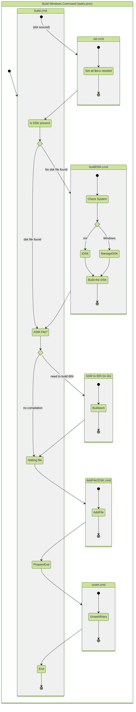

# Command for AMSTRAD Project

## Description

This scripts are for creating a DSK file for use with AMSTRAD emulator.
Automaticly create the dsk file if needed and add the current file to the DSK file.

THIS IS A WORK IN PROGRESS.

## The process

Process description:

Using Mermaid: https://mermaid.js.org/syntax/stateDiagram.html

___